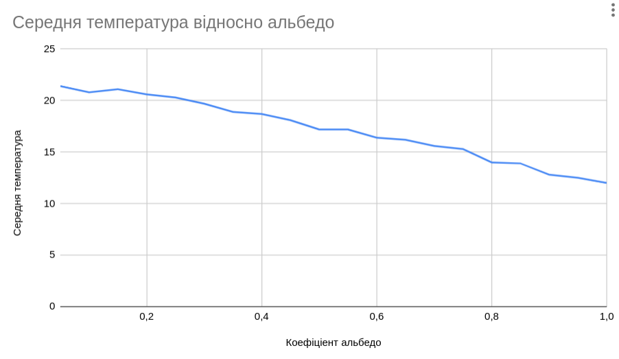
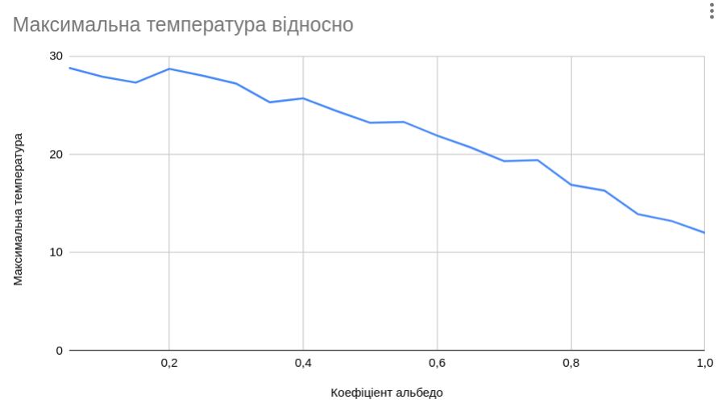
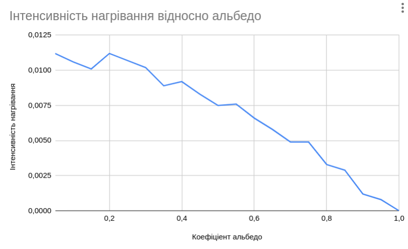
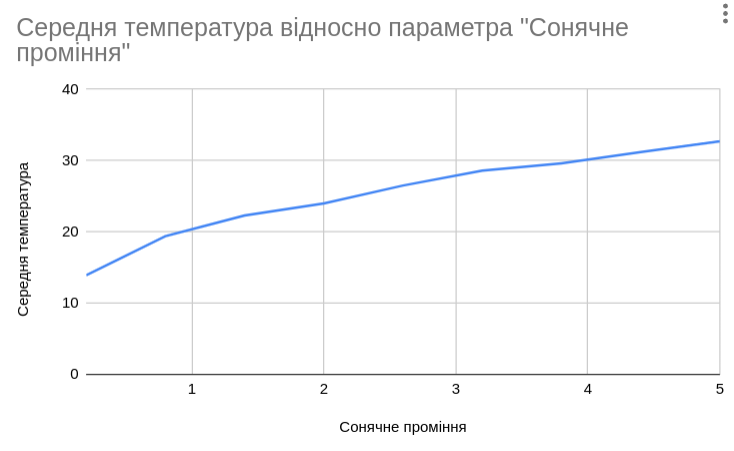
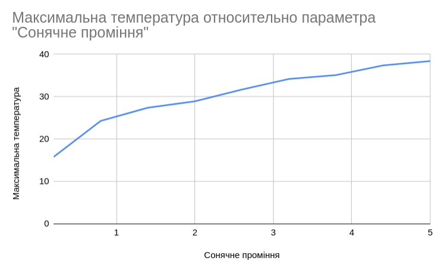
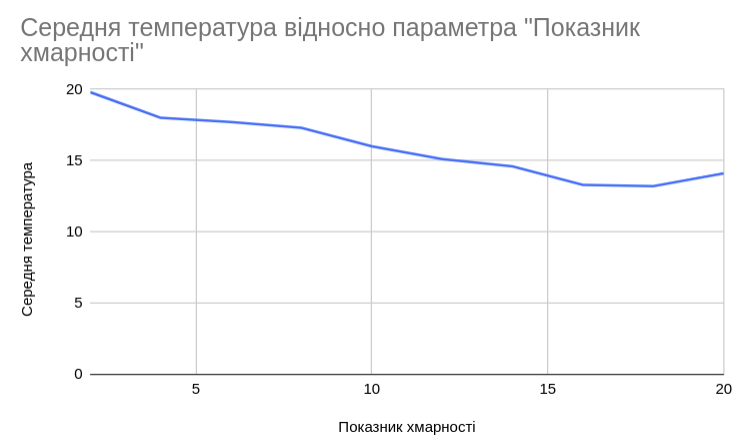
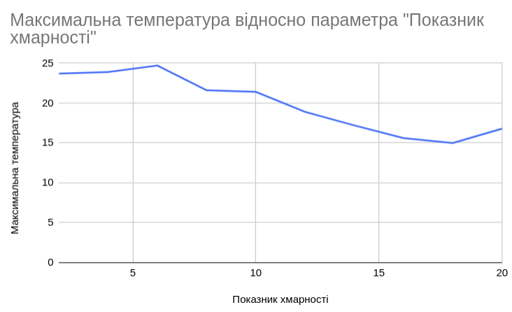
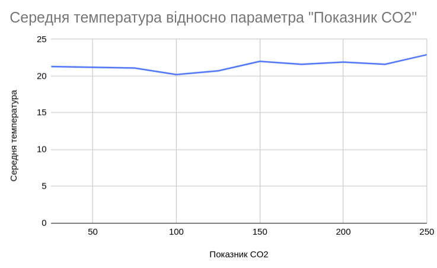
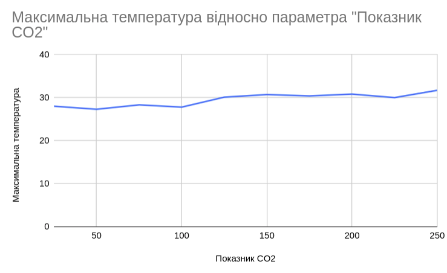

## Комп'ютерні системи імітаційного моделювання
## СПм-22-5, **Біліченко Олександр Олександрович**
### Лабораторна робота №**1**. Опис імітаційних моделей та проведення обчислювальних експериментів

 

### Варіант 2, модель у середовищі NetLogo:
[Climate Change](http://www.netlogoweb.org/launch#http://www.netlogoweb.org/assets/modelslib/Sample%20Models/Earth%20Science/Climate%20Change.nlogo)

 

### Вербальний опис моделі:
Симуляція парникового ефекту планети, а саме впливу енергії сонця на температуру Землі в залежності від факторів середовища. У якості агента виступає промінь, який є представленням певної кількості сонячного проміння, потрапляючого у атмосферу Землі. Окремий агент, потрапляючи у зону дослідження може бути відбитися від хмар або від земної поверхні. Досягнув смуги землі, деяка частина променів може бути не відбитою, та перетворитися у теплову енергію, яка буде підвищувати температуру тіла Землі. Перетворений в інфрачервоне випромінювання промінь, буде намагатись покинути атмосферу. На успішність цього буде впливати кількість CO2 у повітрі. Якщо показник високий - більша частина інфрачервоних променів буде відбита назад у напрямку земної поверхні, що буде прогрессивно збільшувати її температуру. Модель є упрощенною, оскільки розглядає константні показники, які в реальних умовах не можуть бути приведені до середнього значення.

### Керуючі параметри:
- **sun-brightness** визначає кількість агентів у середовищі моделювання. А саме, інтенсивність сонячного випромінювання.
- **albedo** визначає показник властивості відраження сонячного випромінювання від поверхні землі.
- **cloud** визначає показник ступіня хмарності, додаючі до моделі певну кількість об'єктів зі здатністю відбиття сонячного проміння.
- **CO2** визначає показник кількості вуглекислого газу у атмосфері, крок збільшення показника 25 молекул.

### Внутрішні параметри:
- **temperature**. показник накопичення теплової енергії Землі. Змінюється в залежності від кількості випромінювання, яке не було відбито поверхнею. Також є вихідним параметром за яким можна стежити у інтерфейсі моделі.
- **sky-top**. Показник висоти рівня неба. Цей показник впливає на кількість хмар, які можна розмістити у симуляції, а також за визначення рамок дії агентів.
- **earth-top**. Показник рівня землі, так само є показником для означення рамок симуляції, та визначення лінії трансформації енергії.

### Показники роботи системи:
- поточна температура Землі, що відстежується.
- кількість теплової енергії поглиненої поверхнею.

### Примітки:
Усі дослідження приводять до стабілізації температури на певному рівні. Інтенивність досягнення рівня незначих відхилень змінюється, в залежності від зовнішніх факторів.

### Недоліки моделі:
Недостатня кількість вхідних параметрів та їх інтеграція у модель є суттєвим недоліком. Навіть, якщо ми припускаємо, що предметом дослідження є певна ділянка планети ми не враховуємо такі змінні, як час доби (це можна корегувати зменшуючі інтенсивність сонячного випромінювання, але автоматизація вираховування цього параметру, як вихідного могла б покращити властивості моделі). Неврахування рельєфу поверхні. Це можна віднести до загального поняття альбедо, але буде потребувати мануального вичислення цього значення. Також відсутність можливості впливати на фактори зменшення температури землі, нажаль наша модель відображає лише зростання температури, але зовсім ігнорує природні фактори, впливаючі на це (зміна пори року, опади, циклони, зміщення магнітних полів і т.п.). Ще одним недоліком є статичність показнику парникових газів. Наприклад, додавання до моделі показнику лісів, а саме інтенсивності посадки/вирубки, а також показнику інтенсивності впливу людини на рівень CO2 могли б розкрити дану модель з боку більш практичного використання.

 

## Обчислювальні експерименти
### 1. Вплив коефіціенту показника альбедо на температуру та інтенсивність її набору
Досліджується залежність температури Землі протягом певної кількості тактів (1500) від показника альбедо встановленому на початку симуляції. А також інтенсивність набору температури при різних показниках альбедо. Кількість тактів обрана як середня, коли температура починає стабілізуватись.
Експерименти проводяться при значенні альбедо від 0.05 до 1, з кроком 0.05, усього 20 симуляцій. Розрахунок інтенсивності набору температури будемо вираховувати за наступною формлою:

$$
Інтенсивність = (Тmax - Tmin)/Tunit
$$

Інші керуючі параметри мають значення за замовчуванням:
- **sun-brightness**: 1
- **cloud**: 0
- **CO2**: 0

Також вартує винести окремо значення мінімальної температури, яка в даній моделі завжди буде константною та буде дорівнювати 12.

<table>
<thead>
<tr><th>Коефіціент альбедо</th><th>Середня температура</th><th>Максимальна температура</th><th>Інтенсивність нагрівання</th></tr>
</thead>
<tbody>
<tr><td>0.05</td><td>21.4</td><td>28.8</td><td>0.0112</td></tr>
<tr><td>0.1</td><td>20.8</td><td>27.9</td><td>0.0106</td></tr>
<tr><td>0.15</td><td>21.1</td><td>27.3</td><td>0.0101</td></tr>
<tr><td>0.2</td><td>20.6</td><td>28.7</td><td>0.0112</td></tr>
<tr><td>0.25</td><td>20.3</td><td>28.0</td><td>0.0107</td></tr>
<tr><td>0.3</td><td>19.7</td><td>27.2</td><td>0.0102</td></tr>
<tr><td>0.35</td><td>18.9</td><td>25.3</td><td>0.0089</td></tr>
<tr><td>0.4</td><td>18.7</td><td>25.7</td><td>0.0092</td></tr>
<tr><td>0.45</td><td>18.1</td><td>24.4</td><td>0.0083</td></tr>
<tr><td>0.5</td><td>17.2</td><td>23.2</td><td>0.0075</td></tr>
<tr><td>0.55</td><td>17.2</td><td>23.3</td><td>0.0076</td></tr>
<tr><td>0.6</td><td>16.4</td><td>21.9</td><td>0.0066</td></tr>
<tr><td>0.65</td><td>16.2</td><td>20.7</td><td>0.0058</td></tr>
<tr><td>0.7</td><td>15.6</td><td>19.3</td><td>0.0049</td></tr>
<tr><td>0.75</td><td>15.3</td><td>19.4</td><td>0.0049</td></tr>
<tr><td>0.8</td><td>14.0</td><td>16.9</td><td>0.0033</td></tr>
<tr><td>0.85</td><td>13.9</td><td>16.3</td><td>0.0029</td></tr>
<tr><td>0.9</td><td>12.8</td><td>13.9</td><td>0.0012</td></tr>
<tr><td>0.95</td><td>12.5</td><td>13.2</td><td>0.0008</td></tr>
<tr><td>0.1</td><td>12</td><td>12</td><td>0</td></tr>
</tbody>
</table>

Усі три графіки демонструють що рівень альбедо напряму впливає на показники температури. Чим вище альбедо, тим більше сонячних променів відбивається від поверхні і тим повільніше земля набирає температуру.

### 2. Вплив кількості сонячного проміння на температуру
Досліджується залежність температури Землі протягом певної кількості тактів (3000) від кількості сонячного випромінювання встановленому на початку симуляції. На цей раз збільшимо кількість тактів, для більш точних середніх показникиів.
Експерименти проводяться при значенні **sun-brightness* від 0.2 до 5, з кроком 0.6 (Крок обраний відштовхуючись від інтерфейсу NetLogo, тому як мінімальний крок за замовчуванням становить 0.2), усього 9 симуляцій. 
Інші керуючі параметри мають значення за замовчуванням:
- **albedo**: 0.6
- **cloud**: 0
- **CO2**: 0

<table>
<thead>
<tr><th>Сонячне проміння</th><th>Середня температура</th><th>Максимальна температура</th></tr>
</thead>
<tbody>
<tr><td>0.2</td><td>13.9</td><td>15.8</td></tr>
<tr><td>0.8</td><td>19.4</td><td>24.3</td></tr>
<tr><td>1.4</td><td>22.3</td><td>27.4</td></tr>
<tr><td>2</td><td>24</td><td>28.9</td></tr>
<tr><td>2.6</td><td>26.5</td><td>31.7</td></tr>
<tr><td>3.2</td><td>28.6</td><td>34.2</td></tr>
<tr><td>3.8</td><td>29.6</td><td>35.1</td></tr>
<tr><td>4.4</td><td>31.2</td><td>37.4</td></tr>
<tr><td>5</td><td>32.7</td><td>38.4</td></tr>
</tbody>
</table>

На цих графіках також спостерігається доволі однорідна тенденція, яка виявляє, що температура землі тим вища, ніж вища темпертура. Однак, вартує зазначити, що на початку графіків можна спостерігати різкий підйом, а в кінці навпаки, вектор графіка починає наближатися до паралельності вддносно осі x. Це свідотствує про те що при низькому показнику сонячних променів - температура набирається повільно. А при великому кількості сонця кількість відбитих променів також пропроціонально зростає, що дозволяє землі трансформувати лише певну кількість енергії сонця в теплову енергію. На практиці це проявляється як прагнення до стабілізації температури Землі.

### 3. Вплив кількості хмар на температуру
Досліджується залежність температури Землі протягом певної кількості тактів (3000) від кількості хмар встановленому на початку симуляції. Оскільки симуляція не містить наявного показника хмарності будемо вимірювати цей показник кількістю кліків на кнопку
Експерименти проводяться при значенні **sun-brightness* від 2 до 20, з кроком 2, усього 10 симуляцій. 
Інші керуючі параметри мають значення за замовчуванням:
- **albedo**: 0.6
- **sun-brightness**: 1
- **CO2**: 0

<table>
<thead>
<tr><th>Показник хмарності</th><th>Середня температура</th><th>Максимальна температура</th></tr>
</thead>
<tbody>
<tr><td>2</td><td>19.8</td><td>23.7</td></tr>
<tr><td>4</td><td>18</td><td>23.9</td></tr>
<tr><td>6</td><td>17.7</td><td>24.7</td></tr>
<tr><td>8</td><td>17.3</td><td>21,6</td></tr>
<tr><td>10</td><td>16</td><td>21.4</td></tr>
<tr><td>12</td><td>15.1</td><td>18.9</td></tr>
<tr><td>14</td><td>14.6</td><td>17.2</td></tr>
<tr><td>16</td><td>13.3</td><td>15.6</td></tr>
<tr><td>18</td><td>13.2</td><td>15</td></tr>
<tr><td>20</td><td>14.1</td><td>16.8</td></tr>
</tbody>
</table>

Ці графіки частково демонструють відсутність прямої залежності. Є важливим також оцінювати положення хмар у симуліції. Наприклад при переміщенні хмар певним чином в більш хмарний день температура може бути вище ніж в день, коли хмарність була не такою високою. Але загальна тенденція, як і очикувалась підтверджується тим що в цілому показники температури знижаються при додаванні хмар.

### 4. Вплив кількості CO2 на температуру
Досліджується залежність температури Землі протягом певної кількості тактів (3000) від кількості CO2 встановленому на початку симуляції. 
Експерименти проводяться при значенні **CO2** від 25 до 250, з кроком 25, усього 10 симуляцій. 
Інші керуючі параметри мають значення за замовчуванням:
- **albedo**: 0.6
- **sun-brightness**: 1
- **cloud**: 0

<table>
<thead>
<tr><th>Показник CO2</th><th>Середня температура</th><th>Максимальна температура</th></tr>
</thead>
<tbody>
<tr><td>25</td><td>21.3</td><td>28</td></tr>
<tr><td>50</td><td>21.2</td><td>27.3</td></tr>
<tr><td>75</td><td>21.1</td><td>28.3</td></tr>
<tr><td>100</td><td>20.2</td><td>27.8</td></tr>
<tr><td>125</td><td>20.7</td><td>30.1</td></tr>
<tr><td>150</td><td>22</td><td>30.7</td></tr>
<tr><td>175</td><td>21.6</td><td>30,4</td></tr>
<tr><td>200</td><td>21.9</td><td>30.8</td></tr>
<tr><td>225</td><td>21.6</td><td>30</td></tr>
<tr><td>250</td><td>22.9</td><td>31.7</td></tr>
</tbody>
</table>

Згідно графіку, показники температури мають незначне підвищення, при збільшенні рівню СО2 в контексті параметрів за замовчуванням.
Однак із за своїх властивостей він може мультіплікувати показник температури при одночасному зменшенні коефіціента альбедо.